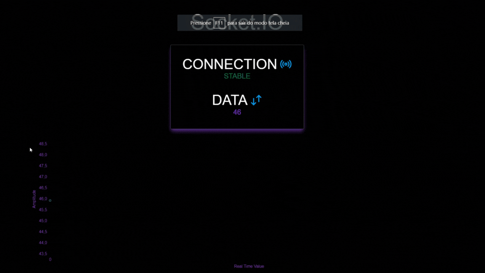

# Real-Time Data Transfer and Visualization using Socket.IO Template

<div align="center">
  <a href="#technologies">Technologies</a> •
 <a href="#recommendations">Recommendations</a> •
  <a href="#usage">Usage</a> •
  <a href="#contributing">Contributing</a> •
  <a href="#running_backend">Running the Backend</a> •
  <a href="#running_frontend">Running the Frontend</a>
</div>

## :camera: Overview

<div align="center" >
  
</div>

<br>
This template provides a simple and efficient way to connect devices and transfer data in real-time to plot in a graph on a website. It is ideal for Internet of Things (IoT) projects, where data needs to be sent directly to the server or client.
<br>
<br>
The template is built using Nest, Socket.IO, React, and Next, and can save you several hours of configuration time. It includes the following components:
<br>
<br>

- A Nest server to handle incoming data and broadcast it to connected clients.
- A Socket.IO client to send data to the server and receive data from other clients.
- A React front-end to display the real-time graph.
- Next.js framework to serve the React app and handle routing.
<br>
<div id="recommendations">
  <h2>:bulb: Recommendations</h2>
</div>

Technically, it is possible to establish a connection and transfer real-time data using only Next.js. However, when the chart begins to store too much data, the loading time of the page may increase significantly, and more processing power may be required on the client-side.
<br>
<br>
To optimize performance and ensure reliable data storage, I recommend using a database with Nest.js. This allows you to refresh the frontend without losing any data, while also being able to clean the graph and start over as needed. Additionally, the database connection enables you to download past data easily and efficiently.
<br>
<br>
Also, to further enhance the functionality of your real-time data transfer and visualization application, you may consider allowing the front-end to send data to the server as well, and this can be easily achieved by uncommenting a few lines of code and modifying the appropriate components.
<br>
<br>
By enabling this feature, you can create a more interactive and dynamic experience for your users. For example, you could allow users to input data directly through the website, which could then be processed and visualized in real-time.
<br>
<br>
To enable data transfer from the front-end to the server, you can modify the Socket.IO client and the Nest.js server to handle incoming data. With these modifications, you can seamlessly integrate data transfer in both directions and create a more comprehensive and robust data visualization system.
<br>
<div id="usage">
  <h2>:hammer_and_wrench: Usage</h2>
</div>

To use this template, simply clone this repository and run npm install to install the required dependencies.
<br>
<br>
You can then start the server by running npm run start:dev in the root directory. This will start the Nest server and serve the React app on localhost:8000.
<br>
<br>
To send data to the server, you can use the provided Socket.IO client. Simply include it in your project and use the emit method to send data to the server.
<br>
<br>
The React front-end is customizable and can be modified to suit your specific needs. The real-time graph can be easily customized using a variety of popular charting libraries. It is being served on localhost:3000 with Next framework.
<br>
<div id="contributing">
  <h2>:raised_hands: Contributing</h2>
</div>

If you would like to contribute to this template, please feel free to submit a pull request or open an issue to improve this template. 
<br>
<div id="technologies">
  <h2>:rocket: Technologies</h2>
</div>

### Backend

✔️ TypeScript | ✔️ Nest | ✔️ Socket.IO

### Frontend

✔️ TypeScript | ✔️ ReactJS | ✔️ NextJS | ✔️ TailwindCSS | ✔️ Chart.js

<br>
<div id="running_backend">
  <h2>⚙ Running [Backend]</h2>
</div>

```bash
# Clone this repository
$ git clone https://github.com/leonardoacr/real-time-data-transfer-socketio

# Access the backend folder

$ cd backend

# Install packages

$ npm install

# Run the server on http://localhost:8000

$ npm run start:dev
```

<br>
<div id="running_frontend">
  <h2>⚙ Running [Frontend]</h2>
</div>

```bash
# Access the frontend folder

$ cd frontend

# Install packages

$ npm install

# Run the server on http://localhost:3000

$ npm run dev
```